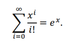
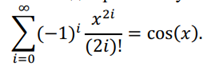
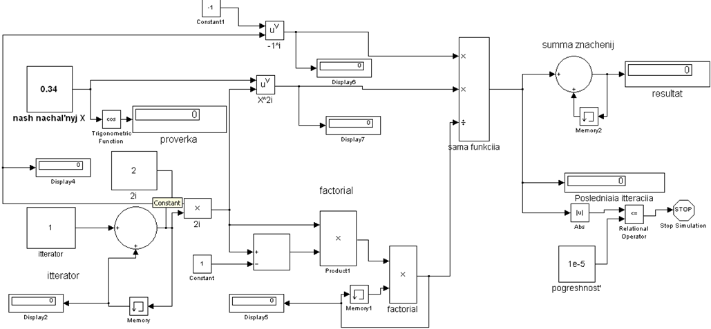

***<h1 align = "center">Знакомство с Simulink</a>***

Выполнил Курдюк И.А.

  

Проверил Пролиско Е.Е.

## **Цель работы**

1) Освоить основные операции используемые при построении модели Simulink (перенос блоков, соединение, настройка параметров, запуск);

  

2) Построить модель вычислительного процесса на примере оценки суммы ряда.

  

  
  
  
  
  
  